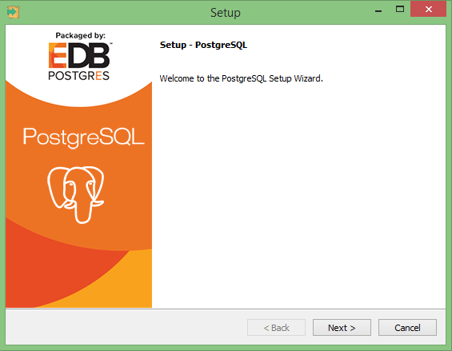
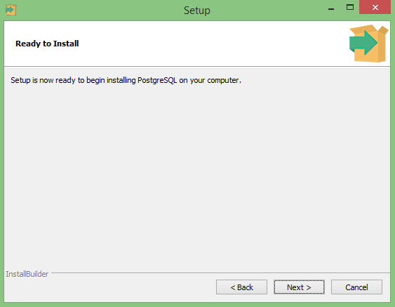
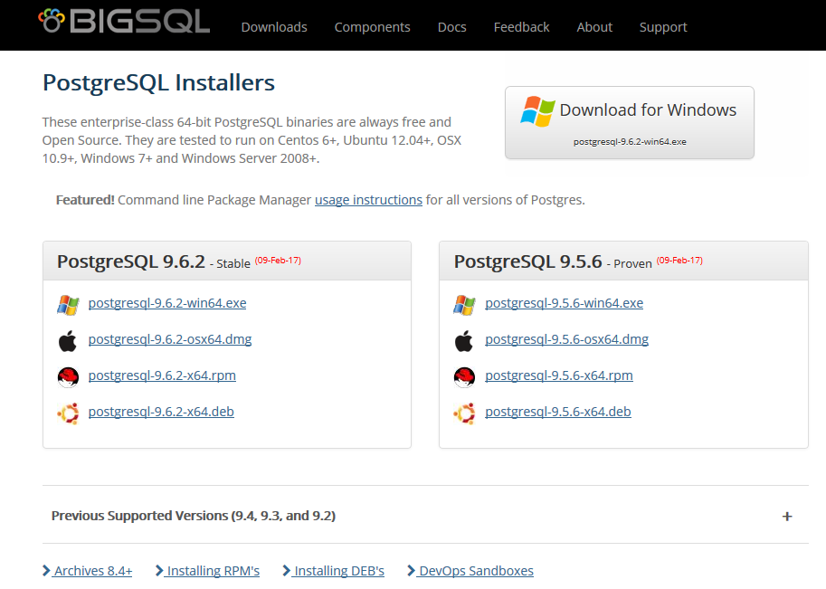

# How to find PostgreSQL for the Windows user,
## An informal walkthrough for the confused from one just as bewildered,
### By Robert Tortorelli
For reference I am running windows 8.1 on an Asus ROG G750JX,

Beginning with the download of postgreSQL we find out selves at this page.

Simple enough, just click the download link, right?  So we click it and get here,

okay still looks straight forward I just click the "Windows" link and that should...

wait, what?

Now things get interesting as we are offered two download options, the "Interactive installer by EnterpriseDB" and the "Graphical installer by BigSQL".  I recommend following the second link (the graphical installer by BigSQL) as you'll end up with a SQL shell terminal that is very similar to what our partners on macs have when using the postgreSQL app.

## Interactive installer by EnterpriseDB -
if you choose this option you'll be directed to this screen

You will need to select your version of PostgreSQL (I'm downloading 9.6.2 for this) and your operating system.  Once you have the installer downloaded you'll open it to see this window

You might see another little window pop up before this saying something about windows C++ but it will go away quickly before showing the setup window

Clicking through the setup you'll be asked to set where you want to store the file

where you want to store the data (yes, this is a different window)

what password you want to use for the database

what port you want the server to run on

and the locale to be used as a default for the server to run on

Once all of that is set you will be ready to install

### Important: Clicking "Next" now will start the download, so be sure you entered everything you wanted correctly

The final window of the installer will ask if you want to install "Stack Builder".  You don't need this for basic running of the program so I will not be covering it.  You can uncheck the stack builder install request and click "Finish"

Now the fun of finding the program.  The files you need should be in a folder labeled "PostgreSQL 9.6" (if you downloaded 9.6.2 like I did) with a directory path of " OS (C:), ProgramData, Microsoft, Windows, Start Menu, Programs, PostgreSQL 9.6" or similar.  The files in the folder that you are looking for are "pgAdmin 4" and "SQL Shell(psql)"

If you are going to use these I suggest pinning them to the start or taskbar so you can find them easier in the future.
PgAdmin 4 is designed to let you easily view the data in your database and edit it as needed, but the user interface is a little clunky and if you want to operate with speed and know how to use a Shell terminal properly you will want to use the SQL Shell.  To use the SQL Shell however you first need to create a database with pgAdmin 4.  Open pgAdmin 4 and click on the "Servers" to expand it

Then click on the "PostgreSQL 9.6" item to expand that, you will be prompted to enter the password you created during the installation to continue

Once you enter the password you'll be able to access the databases.  Right click on "Databases" and select "Create", then "Database"

A new window will pop up where you can enter the basic information of the database (like its name)

Click save when you're done and your new database will be added to the list of "Databases".  Now that you have a database made you can use pgAdmin 4 or the SQL Shell to add information to it.
Opening the SQL Shell will give you this window

You can just hit enter to go through the options here but you need to enter the name of the database you want to work on (in this case "test") and the password you created when you installed the program (depending on your settings you won't be able to see anything that you type here, but it needs your password to work) or the window will throw an error and ask you to press any key to continue and close the windows when any key is pressed.  Once you enter the database and password though, you are ready to work on the database in the shell terminal

## Graphical installer by BigSQL -
if you choose this option you'll be directed to this screen

pick you version of postgreSQL and the installer download should begin automatically.  When it's downloaded run the installer which at the time of writing looks like this

Clicking through the install process you'll be asked where you want to store the files

which components you want to install

which you don't really need the second and third option so you can "next" through this screen.  On this next screen however you do need to put in a password before continuing

Clicking the "Advanced" checkbox will allow you to change where the Data Directory  is and which port the program will run on.  Unless you know what you are doing just leave this part alone as the default port is fine.  Moving forward now brings you to a "Summary" screen

review and click next only when you are ready to install as the installation will start immediately .  With the install done you can close the install window

Now things get a little more difficult, you have to find PostgreSQL on your computer.  Hopefully it will be in the "Programs" folder under your "Start Menu" folder.  The full directory path for me is "OS (C:), ProgramData, Microsoft, Windows, Start Menu, Programs, PostgreSQL".  In the PostgreSQL folder you should see a file called "PSQL"

this is your SQL Shell.  Double click it and it should bring up a window that looks like this

You are now ready to use postgreSQL.  I highly suggest that you right click the "PSQL" and pin it to your start or task bar

this will make it a lot easier to find later.

If you can't find "PSQL" in the "PostgreSQL" folder, then you can search for "PSQL".  You'll want to find something that looks like this

and pin that to your start or taskbar.

One last thing you'll want to do when you just start using postgreSQL is to check which "Roles" you have available.  You can do this by using the command "\du".

If you are like me the only role postgreSQL has will be the "postgres" role.  You can also see this by using the command, "SELECT * FROM pg_roles".

If postgres is the only role in postgreSQL then you are going to get an error when you try to run certain migrate or seed commands in the git command line terminal.  This error occurs because the knex files are setup to look for a role that shares a name with the current active user (in this case me, Robert Tortorelli).

To get around this you need to add a new role with named the same as your user name to the roles in postgreSQL.  To do this you'll want to use the command line that follows substituting your user name for "tester" in the command , "CREATE ROLE tester SUPERUSER INHERIT CREATEROLE CREATEDB LOGIN REPLICATION BYPASSRLS;"

When run this will add a new role to postgreSQL.

If you have a user name like mine you can input it inside quotation marks to get it to work.

With the new role added you should be able to use the knex migrate and seed functions.

If you want to make a database with this new role as the owner you will need to run a command to set the role which is simply "SET ROLE" followed by the name of the role you want to create the database under.

